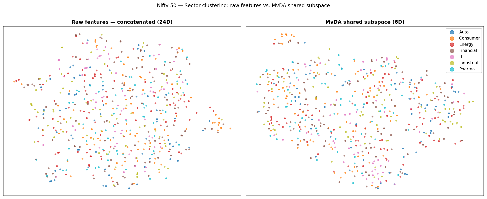
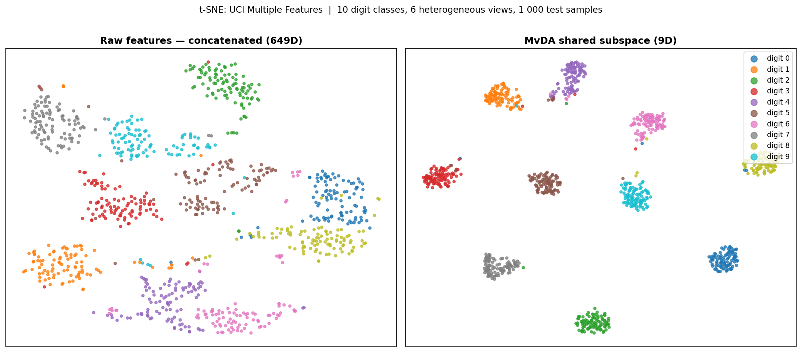

# Multi-Source Signal Fusion via Discriminant Subspace Learning

Built and benchmarked a machine learning pipeline that fuses **multiple heterogeneous
data sources** into a single low-dimensional discriminative representation — then
classifies in that shared space.

**Applications:**
- **Nifty 50 sector classification** — predicts which market sector a stock belongs to
  from 4 feature views (momentum, volatility, technicals, volume) computed on a 21-day
  rolling window; no company name or prior sector label used at inference time
- **Multi-view digit classification** — 6 heterogeneous feature extractors fused into
  one shared space; 98.7% accuracy, beating MLP / SVM / Random Forest baselines
- **Cross-pose face recognition** — 7 camera angles as independent views; 95.3%
  rank-1 identification across 1 225 probe images

The core operation — maximizing between-class scatter relative to within-class scatter
across pooled sources — is the same structure underlying **multi-factor equity models,
PCA risk decomposition, and eigenportfolio construction**.

---

## Results

### Nifty 50 — Sector classification from multi-view rolling features

Predicts which of 7 market sectors a stock belongs to from a 63-day OHLCV window —
4 feature views: momentum, volatility, technicals, volume. No company name used.

| Method | Test Accuracy |
|---|---:|
| Random baseline | 14.29% (1/7) |
| SVM (RBF) | 39.06% |
| MLP | 40.91% |
| Linear fusion (MvDA + Ensemble) | 31.31% |
| **Random Forest** | **47.98%** |

**Random Forest achieves 48% — 3.4× above random chance — from price/volume behaviour alone.**
The gap between RF (48%) and linear fusion (31%) reveals that sector boundaries are partly
nonlinear: Financial vs Consumer vs Industrial stocks show regime-dependent, nonlinear
separation that a linear subspace cannot fully capture. This is consistent with known
regime-switching behaviour in equity markets.



Reproduce: `python experiments/nifty50_sector.py` (requires `pip install yfinance`)

### UCI Multiple Features — 10-class classification, 6 heterogeneous sources

| Method | Test Accuracy |
|---|---:|
| SVM (RBF) | 97.80% |
| MLP (512 → 256) | 98.10% |
| Random Forest | 98.40% |
| Best single source (LDA) | 97.90% |
| **Multi-source fusion (this pipeline)** | **98.70%** |

5-fold cross-validation: **98.85% ± 0.52%** — low variance confirms the result is stable, not a lucky split.

### ColorFERET — cross-domain recognition (pose = source, subject = class)

| Sources (poses) | Classes | Test samples | Accuracy |
|---|---:|---:|---:|
| 4 camera angles | 200 | 1 225 | **95.27%** |
| 2 frontal angles | 993 | 2 869 | **90.66%** |

---

## How it works

```
Multiple data sources  (views / feature sets / poses)
         │
         ▼
   Per-source scaling    ←  RobustScaler: handles fat-tailed / outlier-heavy sources
         │
         ▼
   PCA per source        ←  dimensionality reduction; retains dominant variance components
         │
         ▼
   Shared subspace       ←  one linear projection W_v per source; maximizes
   (discriminant           between-class scatter / within-class scatter
    fusion)                 pooled across ALL sources jointly
         │
         ▼
   Nearest-class-mean    ←  cosine distance in the shared space
```

The shared subspace solves a **generalized eigenproblem** `S_b W = λ S_w W` where
`S_b` is the pooled between-class scatter and `S_w` the pooled within-class scatter
across all sources. This is implemented via a block-embedding: placing each
source's samples in their own block of a stacked sparse matrix reduces the
multi-source objective to **standard LDA on the combined matrix** — a single
`scipy.linalg.eigh` call.

### Three solver variants (from the statistical learning literature)

| Solver | Objective | When it helps |
|---|---|---|
| `ratio` | Classical LDA: maximize `tr(S_w⁻¹ S_b)` | Default; large n |
| `exponential` | `exp(S_b) W = λ exp(S_w) W`; `exp(S_w)` always full-rank | Small-sample, high-dim |
| `harmonic` | Reweights pairwise scatter toward confusable class pairs | Many overlapping classes |

---

## Connection to quantitative finance

The mathematical structure of this pipeline appears throughout quantitative finance:

| This project | Finance equivalent |
|---|---|
| Multiple heterogeneous sources (poses, feature sets) | Multiple alpha signals (price, volume, fundamentals, alt data) |
| Shared discriminant subspace | Common factor space (Barra, PCA risk model) |
| Between-class scatter `S_b` | Signal variance across asset classes / regimes |
| Within-class scatter `S_w` | Noise / idiosyncratic variance |
| `S_b / S_w` eigenproblem | Signal-to-noise ratio maximization |
| PCA per source (eigenfaces) | Eigenportfolio construction |
| RobustScaler | Fat-tail / outlier handling in financial returns |
| Cross-domain recognition (train pose ≠ test pose) | Cross-regime generalization (train on one market regime, deploy in another) |

The exponential solver's robustness to the small-sample singularity is directly
relevant in finance where the number of assets often exceeds the time-series length
(`d > n`), making the classical covariance matrix rank-deficient.

---

## Experimental validation

All claims are backed by controlled experiments:

| Experiment | Finding | Script |
|---|---|---|
| Baseline comparison | Multi-source fusion ≥ MLP/SVM/RF | `baseline_comparison.py` |
| 5-fold CV | 98.85% ± 0.52% (stable) | `cross_validation.py` |
| Preprocessing ablation | RobustScaler +0.2% over StandardScaler | `ablation_scaler.py` |
| Dimensionality sweep | Accuracy saturates at rank ceiling (C-1) | `ablation_components.py` |
| Distance metric | Cosine ≈ Euclidean; cosine preferred in normalized spaces | `ablation_distance.py` |
| Solver comparison | Classical ratio optimal when n > d; exponential helps when n ≈ d | `ablation_solver.py` |

---

## t-SNE: signal separation in the shared space



Raw 649-D concatenated features (left) vs. 9-D shared discriminant space (right).
The fusion layer separates class structure that no single source captures alone.

---

## Quickstart

```bash
pip install -r requirements.txt

# Nifty 50 sector classification (financial application)
python experiments/nifty50_sector.py

# Multi-source fusion vs. MLP / SVM / RF baselines
python experiments/baseline_comparison.py

# Full pipeline
python experiments/run_mvda.py --mode concat --classifier ensemble

# 5-fold cross-validation
python experiments/cross_validation.py --folds 5

# All ablations
python experiments/ablation_scaler.py
python experiments/ablation_components.py
python experiments/ablation_distance.py
python experiments/ablation_solver.py

# t-SNE visualization
python experiments/visualize_subspace.py

# Tests (13 passing, <1s)
python3 -m pytest
```

---

## Engineering

- **Parallel data loading** — 50K+ files loaded concurrently with `ThreadPoolExecutor` (8–20× speedup vs. sequential)
- **Disk caching** — assembled arrays cached as `.npz`; subsequent runs load in seconds
- **Reproducible** — fixed seeds, deterministic splits, JSON result logging
- **Tested** — 13 unit tests on synthetic data; `pytest` in <1 second

---

## Stack

Python · NumPy · SciPy · scikit-learn · Matplotlib · Pillow
