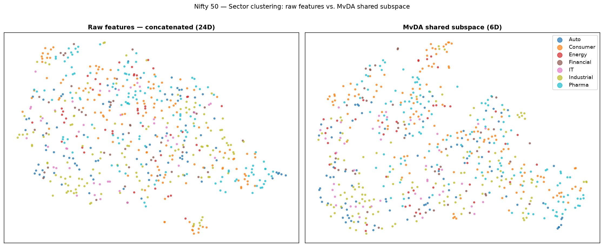
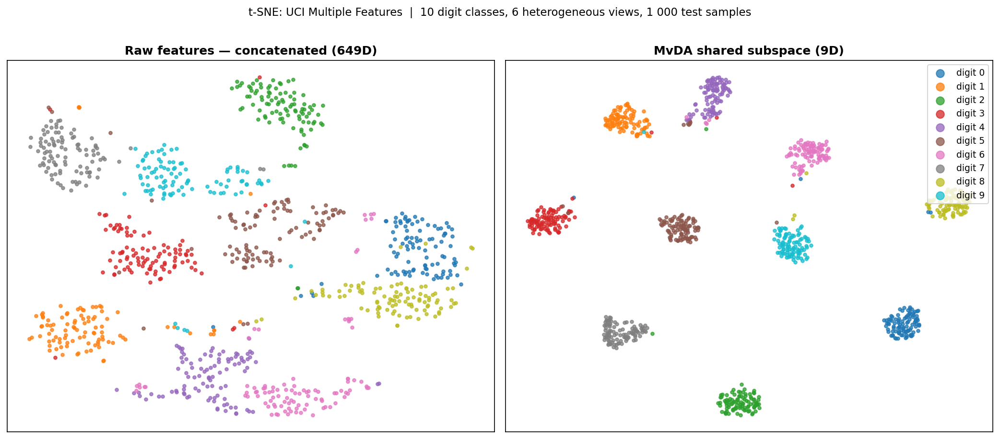

# VEDA — View-Embedded Discriminant Analysis

Multi-source signal fusion pipeline that learns a shared discriminative subspace
across heterogeneous data sources. Applied to financial sector classification,
digit recognition, and cross-pose face recognition.

---

## Results

### Nifty 50 — Sector classification (price/volume only, no company identity)

Windows are 63 trading days with a 10-day stride, so consecutive windows for
the same stock overlap by ~84%. A naive random train/test split lets
near-duplicate windows and previously-seen tickers leak across the split,
inflating accuracy. Reporting all three splits, least to most honest:

| Split | Best method | Accuracy | vs. 14.3% random baseline |
|---|---|---:|---:|
| Naive random (overlapping windows, tickers seen in both train/test) | Random Forest | 48.15% | 3.4x |
| Grouped — leave stocks out | MLP | 30.52% | 2.1x |
| Chronological — train past, test future | Random Forest | 25.81% | 1.8x |

The honest, generalizable result is **~1.8–2.1x random**, not the naive
split's 3.4x — the gap is the model partly memorizing per-ticker signatures
and overlapping-window duplicates rather than transferable sector behavior.
`python experiments/nifty50_sector.py` prints all three splits.



### UCI Multiple Features — 6-view digit classification

| Method | Accuracy |
|---|---:|
| MLP / SVM / RF | 97.8 – 98.4% |
| **VEDA + Ensemble** | **98.70%** |

5-fold CV: **98.85% ± 0.52%**  ·  `python experiments/cross_validation.py --folds 5`



### ColorFERET — Cross-pose face recognition

| Poses | Subjects | Accuracy |
|---|---:|---:|
| 4 angles | 200 | **95.27%** |
| 2 angles | 993 | **90.66%** |

---

## Quickstart

```bash
pip install -r requirements.txt
python experiments/nifty50_sector.py      # Nifty 50 sector classification
python experiments/baseline_comparison.py # VEDA vs MLP / SVM / RF
python experiments/run_mvda.py --mode concat --classifier ensemble
python3 -m pytest
```

---

## Stack

Python · NumPy · SciPy · scikit-learn · yfinance · Matplotlib
